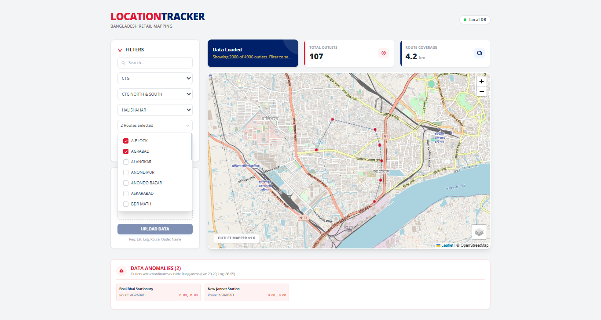

# Outlet Location Tracker
**Faisal Meah / portfolio** &nbsp; [](https://github.com/Farabi1096/portfolio) [](https://www.linkedin.com/in/farabi-hsn/)

---

### 🛠️ Tech Stack
  

---

### 

> **Problem:** Field managers have no efficient way to verify TA/DA route claims, identify coverage gaps, or validate outlet GPS data across thousands of retail points — leading to inflated travel claims and blind spots in distributor territory planning.  
> **Solution:** A zero-backend, browser-based mapping tool that ingests CSV outlet data, visualizes locations on an interactive map with cascading business hierarchy filters, flags GPS anomalies, and calculates optimized route distances — all stored locally via IndexedDB.

---

#### 🔄 How It Works

**Step 1: CSV Upload & Validation** Users upload outlet master data containing coordinates and metadata. The system auto-detects column headers (with alias support), parses records, and separates valid outlets from anomalies — any coordinates falling outside Bangladesh boundaries (Lat: 20–29, Lng: 86–95) are flagged automatically.

**Step 2: Interactive Map Rendering** Valid outlets are plotted on an interactive Leaflet map with marker clustering. Users can toggle between street, satellite, and terrain layers. Clicking any marker reveals full outlet metadata including code, name, route, and distributor details.
<p align="center">
  
</p>

**Step 3: Cascading Hierarchy Filters** The filter panel mirrors the real business structure: **Area → Territory → Town → Route**. Selecting any level automatically populates downstream options and re-renders the map. Multiple routes can be selected simultaneously for comparative analysis.

**Step 4: Route Distance Calculation** The app connects filtered outlets using a nearest-neighbor algorithm, drawing a realistic travel path in geographic order. Total route distance (in km) updates as a live KPI — enabling managers to cross-check against submitted TA/DA claims.

---

#### 📊 Data Schema

The system expects CSV data aligned to the FMCG distribution hierarchy:

| Field | Purpose | Logic |
| :--- | :--- | :--- |
| **Area / Territory** | Regional Filtering | Top-level cascading dropdown population. |
| **Town / Route** | Micro-Level Navigation | Filters map to specific beat-level outlet clusters. |
| **Outlet Name / Code** | Outlet Identification | Powers global search and marker popup details. |
| **Latitude / Longitude** | Geospatial Plotting | Validated against Bangladesh boundaries; anomalies flagged. |

Optional fields like **Distributor Name**, **Channel** (GT/MT), and **Last Visit Date** are auto-detected and included in marker popups when present.

#### 📄 Sample CSV

```csv
Outlet Latitude,Outlet Longitude,Route Name,Outlet Name,Area Name,Territory Name,Town Name,Outlet Code
23.8103,90.4125,Route-Gulshan-01,Karim Store,Dhaka Metro,Dhaka North,Gulshan,OUT-0001
23.7515,90.3934,Route-Dhanmondi-03,Rahim Pharmacy,Dhaka Metro,Dhaka South,Dhanmondi,OUT-0002
22.3569,91.7832,Route-CTG-Main,Chattogram Grocery,Chittagong,CTG City,Agrabad,OUT-0003
24.3636,88.6241,Route-Rajshahi-01,Rajshahi Mart,Rajshahi,Rajshahi Sadar,Boalia,OUT-0004
```

#### 💡 Project Impact
* **TA/DA Accountability:** Route distances are calculated from actual GPS coordinates — eliminating guesswork from travel claim verification.
* **Coverage Gap Detection:** Filtering by Territory or Town instantly reveals geographic white spaces where no outlets exist.
* **Bulk Data Auditing:** Supports 50,000+ outlet records with automatic valid/invalid separation and a dedicated anomaly review panel.
* **Zero Infrastructure Cost:** No server, no API keys, no recurring fees — runs entirely in the browser with IndexedDB persistence.

---
